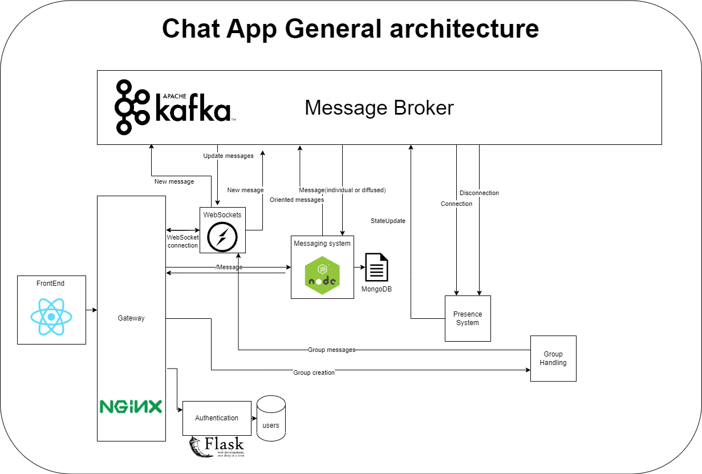

# Devops-Lab
This is a DevOps Lab that is centered around building a real-time chat application that is deployed and managed independently using tools such as Kubernetes and Helm. Monitoring tools such as Prometheus and Grafana can be used to track the performance and availability of the services.  
Resources' provisioning is automated on Azure using terraform and deployment is automated via ArgoCD

The real-time chat application is a web-based messaging platform that allows users to send and receive messages in real-time.  
 It consists of a frontend service, which is a web application that serves that establishes websocket connections to the backend services, and a backend services, which is a websocket server that handles real-time communication between the frontend and the backend. The backend service stores and retrieves messages from a database and broadcasts them to all connected clients.  

The backend is decomposed into multiple microservices:    

1- An "authentication service" that authenticates users and authorizes their access to certain resources or actions.

2- A "Gateway" service that handles the websocket connection with the front. 
Each received message  is produced in a general "messages" topic, that is then consumed by the messaging service.  
This service also consumes messages from a topic related to the connected user and send them back to the front in real time.  
This services also produces connection related info in a "presence" topic, that will be treated later to determine users' presence

3- A "Messaging service" that consumes messages from the "messages" topic, treats & stores them in a MongoDB database and produces them in the users'/groups topic.

4- A "Presence service" that keeps track of which clients are currently connected and available for messaging by consuming information from the "presence" topic.

5- An "groups management service" that keeps track of who is in which group and handles the different relations and between users and group creation rules.

## Scalability
To Ensure the application scalability, the correct diffusing of messages, and the possibility for the same users to be connected with different devices, we are using apache Kafka as a message bus. 

## Advancements

- Front end [x]
- Backend: 
  - Auth service    [X]
  - WebSockets      [X]
  - Message Handler [X]
  - Presence System [ ]
  - Group manager   [ ]
- CI/CD ( building and pushing docker image/service on every tag)
- Docker-compose available to run the project locally. Just change the .env.template files 
- Deployment:
  Helm charts available at /infrastructure/charts:
  - Backend available services charts [X]
  - Databases chart [X]
  - Front end chart [ ]
  - Deployment strategy (unset, but we're going for a shadow strategy)
- Provisioning:
  the provisioning is separated into multiple micro stacks:
  - 0 - Creation of a Resource group & Storage Blob [X]
  - 1 - Creation of AKS Service & policies set [X]
  - 2 - Creation of Databases [X]
  - 3 - Creation of Monitoring resources [X]
  - 4 - Setting up ArgoCD [ ]
  - 5 - Installing the release from local chart [X] (to cover step 4 since it's failing)